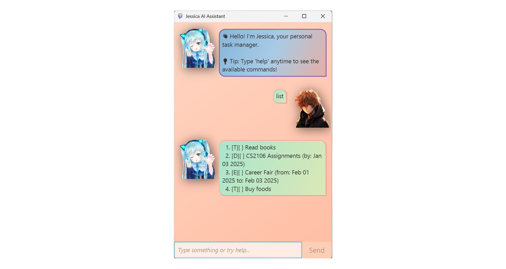

# Jessica Chatbot Project 🌟
Welcome to Jessica, an interactive chatbot application designed to manage tasks efficiently. This project supports various task-related commands, including adding, marking, deleting, and finding tasks. Below are instructions and details of the implementation.

## Features of the Project 🛠️
- **Task Management:** Add, delete, and modify tasks in real-time.
- **File Storage:** Save and load tasks from a file on disk.
- **Command Recognition:** Recognizes multiple task types (e.g., todo, deadline, event).

## How to Run the Project 🚀
1. Ensure that Java version 17 or above is installed in your device.
2. [Download](https://github.com/nhocmt227/ip/releases/download/v3/jessica.jar) the latest release in GitHub
3. Open the terminal and run the project:
   `java -jar jessica.jar`, or click the jar file to run the project.

## Supported Commands 📋
Here’s a list of commands Jessica recognizes:
- `list`: Display all tasks.
- `todo`, `deadline`, `event`: Add different types of tasks.
- `delete`: delete a task.
- `mark`, `unmark`: mark or unmark the task as done.
- `find`: find a task.
- `bye`: exit the chatbot.

## Development Tasks ✅
- [x] Implement task storage functionalities.
- [x] Add command parsing logic.
- [x] Include Unit Tests and System Tests for error handling.
- [ ] Implement additional user commands.

> **Note: The project currently supports simple text-based task commands. Future enhancements may include GUI integration and additional features.**

Feel free to explore the code, submit PRs, and contribute to the project! 😊
